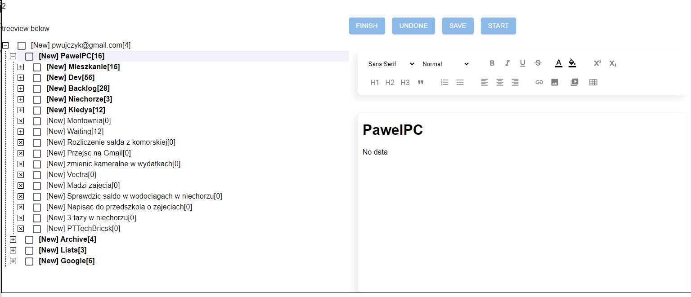

<!--Category:PowerShell--> 
 

    <a href="http://http://productivitytools.tech/"><a> 
    

    

## GetTask3 - Web

Frontend for GetTask3 application. 

GetTask3 - application to manage tasks. It has hierachical structure and details. It is open project so it allows for a lot of integrations. I did it mainly for the learning purpose. 

<!--more-->

First version was only powershell taks manager. Now it is 3rd version which has web, powershell version. 

